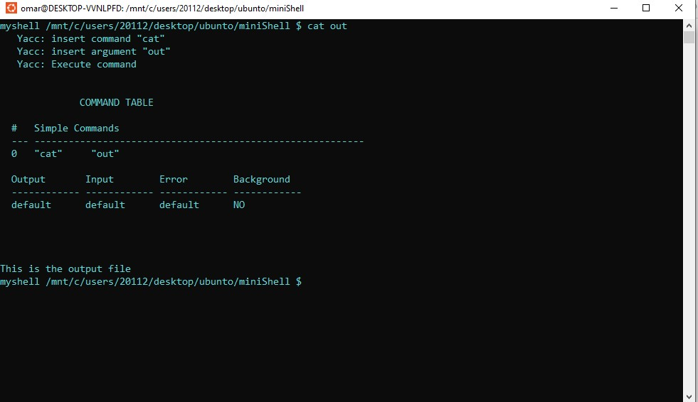
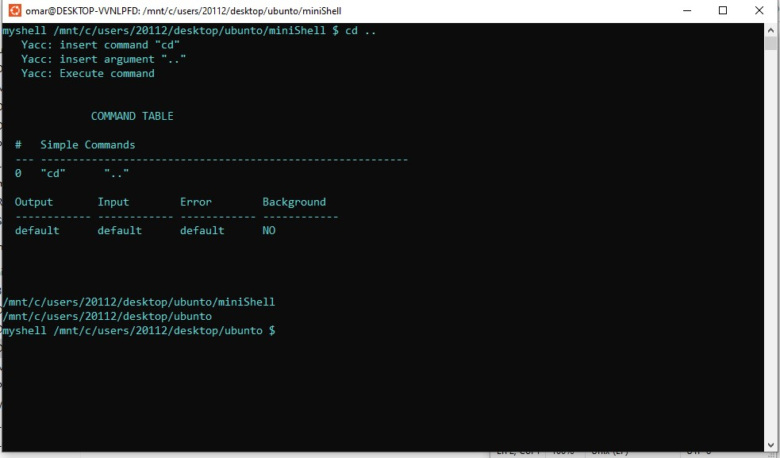
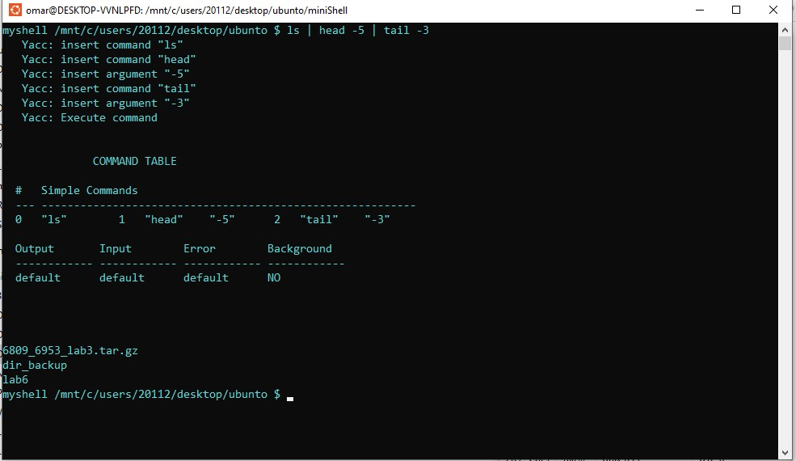
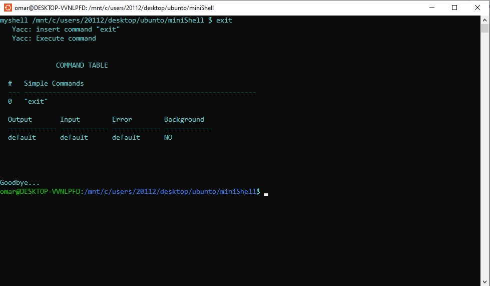

# Mini-Shell
Project simulating a shell
## User Manual
This project simulates a linux terminal, therefore you should expect to use the same commands you are able to use in linux

### Make the file
type "make clean" to remove any changes from before
then type "make" to make the file
then type "./shell" to run the program

### testing simple commands
ex: cat | out

ex: cd ..

ex: ls | head -5 | tail -3

ex: exit

This is just a demo, feel free to try out other commands you see fit.
